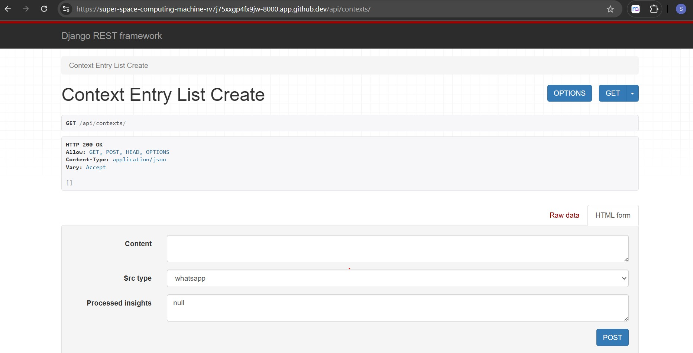

# Backend: Django REST Framework

The project at this stage currently enable the following  API endpoints:

## GET APIs

- /api/tasks
- /api/categories
- /api/contexts

## POST APIs

- /api/tasks
- /api/categories
- /api/contexts

## An example of API endpoint for Contexts

